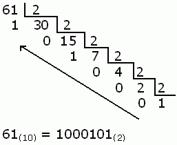

.. index::
   single: Sistemas de Numeración

Sistemas de Numeración
======================

Decimal
-------

El sistema de numeración que utiliza­mos habitualmente es el decimal, el valor de cada dígito está asociado al de una potencia de base 10, número que coincide con la cantidad de símbolos o dígitos del sistema decimal, y un exponente igual a la posición que ocupa el dígito menos uno, contando desde la de­recha.

.. math::

 Dígi­tos (0, 1, 2, 3, 4, 5, 6, 7, 8, 9) 

..

Binario
-------

El sistema de numeración binario utiliza sólo dos dígitos.En una cifra binaria, cada dígito tiene distinto valor dependiendo de la posición que ocupa

.. math::

 Dígi­tos (0, 1) 

..

Octal
-----

En el sistema de numeración octal, los números se representan mediante ocho dígitos diferentes. Cada dígito tiene un valor distinto dependiendo del lu­gar que ocupen. El valor de cada una de las posiciones viene determinado por las potencias de base 8.

.. math::

 Dígi­tos (0, 1, 2, 3, 4, 5, 6, 7, 8 ,9 ,A,B,C,D,E,F) 

..

Hexadecimal
-----------
En el sistema de numeración hexadecimal se representan con dieciséis símbolos,se utilizan los caracteres A, B, C, D, E y F representando las cantidades decima­les 10, 11, 12, 13, 14 y 15 respectivamente.

.. math::

 Dígi­tos (0, 1, 2, 3, 4, 5, 6, 7, 8 ,9 ,A, B, C, D, E, F) 

..

Transformación 
--------------

La transformación sea realiza mediante operaciones matématicas dependiendo de la base de este y a que sistema se desee transformar.

.. math::

    Decimal: Base10

    Binario: Base2

    Octal: Base8

    Hexadecimal: Base 16
..

Transformación Decimal a Binario
~~~~~~~~~~~~~~~~~~~~~~~~~~~~~~~~

- Los pasos son el numero Decimal (Base10) didirlo entre 2 tantas veces como sea necesario hasta que tengamos de cociente un 1 o un 0. 

- Además, debemos ir anotando el resto que obtenemos en cada una de las divisiones.

..

Transformación Decimal a Octal
~~~~~~~~~~~~~~~~~~~~~~~~~~~~~~

- Los pasos son el numero Decimal (Base10) didirlo entre 8  tantas veces como sea necesario hasta que tengamos de cociente un 1 o un 0. 

- Además, debemos ir anotando el resto que obtenemos en cada una de las divisiones.toma el número entero y se divide entre 8 repetidamente hasta que el
dividendo sea menor que el divisor, para colocar entonces el número 0 y pasar el dividendo a formar el primer dígito del número equivalente en
decimal.

.. image:: images/octal.jpg
   :width: 400
..

Transformación de Decimal a Hexadecimal
~~~~~~~~~~~~~~~~~~~~~~~~~~~~~~~~~~~~~~~

- Los pasos son el numero Decimal (Base10) dividirlo entre 16 tantas veces como sea necesario hasta que tengamos de cociente un 1 o un 0. 

- Además, debemos ir anotando el resto que obtenemos en cada una de las divisiones.

- Los números enteros resultantes de los cocientes, pasarán a conformar el número hexadecimal correspondiente, teniendo en cuenta que el sistema de
numeración hexadecimal posee solo 16 símbolos,

.. image:: images/octal.jpg
   :width: 400
..

Transformación de Binario a Hexadecimal
~~~~~~~~~~~~~~~~~~~~~~~~~~~~~~~~~~~~~~~

.. image:: images/octal.jpg
   :width: 400
..

.. image:: images/octal.jpg
   :width: 400
..

Transformación de Binario a Octal
~~~~~~~~~~~~~~~~~~~~~~~~~~~~~~~~~

Transformación de Binario a Decimal
~~~~~~~~~~~~~~~~~~~~~~~~~~~~~~~~~~~

Transformación de Binario a Hexadecimal
~~~~~~~~~~~~~~~~~~~~~~~~~~~~~~~~~~~~~~~

Transformación de Octal a Binario
~~~~~~~~~~~~~~~~~~~~~~~~~~~~~~~~~

Transformación de Octal  a Decimal
~~~~~~~~~~~~~~~~~~~~~~~~~~~~~~~~~~

Transformación de Octal a Hexadecimal
~~~~~~~~~~~~~~~~~~~~~~~~~~~~~~~~~~~~~

Transformación de Hexadecimal al a Binario
~~~~~~~~~~~~~~~~~~~~~~~~~~~~~~~~~~~~~~~~~~

Transformación de Hexadecimal a Decimal
~~~~~~~~~~~~~~~~~~~~~~~~~~~~~~~~~~~~~~~

Transformación de  Hexadecimal a  Octal
~~~~~~~~~~~~~~~~~~~~~~~~~~~~~~~~~~~~~~~
